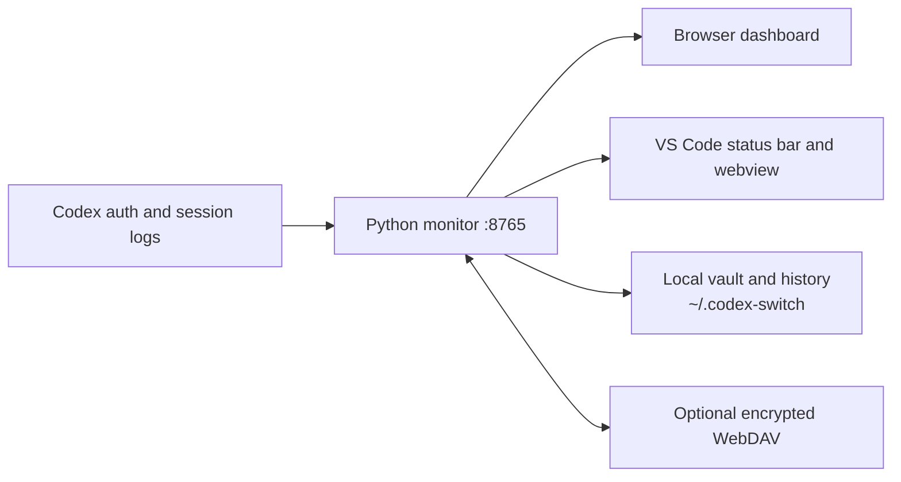

<div align="center">

# Codex Usage Monitor

**A local-first Codex quota, token, cost, account, skill, and encrypted-sync dashboard for VS Code.**

[](#quick-start)
[](https://www.python.org/)
[](https://code.visualstudio.com/)
[](#requirements)
[](https://www.gnu.org/licenses/gpl-3.0.html)

English · <a href="./README.zh-CN.md">简体中文</a>

</div>

Codex Usage Monitor combines the authoritative 5-hour and 7-day limits reported by the Codex service with locally parsed session tokens and estimated cost.
A lightweight Python service owns the data, dashboard, account vault, managed skills, and optional encrypted WebDAV synchronization; the VS Code extension adds a status-bar summary and opens the same live dashboard.

> [!IMPORTANT]
> The extension does not start the Python monitor. Start `python monitor_codex_usage.py` first and keep it running.

## Why use it?

| Capability | What you get |
| --- | --- |
| Live quota monitoring | Authoritative 5-hour and 7-day percentages, reset times, plan-aware history curves, and lightweight five-second status refreshes. |
| Token and cost analytics | Fresh input, cached input, cache writes, output, cache-hit rate, per-model totals, Standard/Fast attribution, and estimated cost. |
| Multiple Codex accounts | Safe local account switching, login-slot creation, rename/delete controls, identity validation, and per-account history attribution. |
| Skill management | Discover Codex and Gemini skills, move them into one private managed store, assign them with strict links or managed fallbacks, and synchronize changes. |
| Encrypted multi-machine sync | AES-256-GCM WebDAV packages for skills, move-only account transfer, and incremental usage journals with verified writes. |
| Local-first privacy | Credentials and raw recorder data stay under `~/.codex-switch`; dashboard payloads redact secrets and cloud-downloaded history never contaminates local recorder files. |
| Resilient operation | Atomic local writes, bounded incremental session-log scanning, revision-keyed response caches, conditional cloud updates, rollback-aware key rotation, and extensive unit coverage. |

## How it fits together



The monitor is authoritative. The extension polls `/api/status` while visible, reloads `/api/series` only when its revision changes, and uses its bundled dashboard only when the live page cannot be reached.

## Requirements

- Python 3.12 or newer on Windows and Linux.
- VS Code 1.96 or newer for the extension.
- A working Codex login in the normal `CODEX_HOME`.
- Port `8765` available.
- Python dependencies from `requirements.txt`—currently `cryptography>=46.0.0,<47`.
- Network/proxy access compatible with the environment variables recognized by Python and `monitor_common.py`.

## Quick start

### 1. Install the standalone runtime

Use the matching artifacts from `release/`:

1. Copy `release/runtime/` to a permanent location.
2. Open a terminal in that directory.
3. Install the dependency and start the monitor:

```console
python -m pip install -r requirements.txt
python monitor_codex_usage.py --dashboard
```

Without `--dashboard`, the service starts normally but does not open a browser:

```console
python monitor_codex_usage.py
```

### 2. Install the VS Code extension

Install `release/codex-usage-monitor-1.0.0.vsix` from VS Code:

1. Open **Extensions**.
2. Select **Views and More Actions (…) → Install from VSIX…**.
3. Choose the VSIX and reload VS Code if requested.

The command line is also supported:

```console
code --install-extension release/codex-usage-monitor-1.0.0.vsix
```

### 3. Complete first-run setup

1. Keep the Python monitor running.
2. Open `http://127.0.0.1:8765` or click the Codex status-bar item.
3. Create a control password when prompted. Initial setup is accepted only from the same computer, and `123456` is rejected.
4. Use **Manage skills & accounts** for account, skill, WebDAV, server, and configuration operations.

You now have local quota, token, cost, model, and account history. WebDAV is optional.

## Using the dashboard

The top cards show the latest 5-hour and 7-day usage, reset times, plan, and active account. The charts and selectors provide:

- **Date / 5h / 24h / 7d / 30d / All** time ranges.
- Model filters for token and cost analysis.
- Account filters shared by quota, token, and cost views.
- **Local** and **Merged** token/cost datasets.
- Separate colored quota curves per selected account.
- Fresh input, cached input, output, cache write, cache-hit rate, and estimated cost.

The Local/Merged selector controls token and cost data. Quota curves always use merged quota history because the service percentage is shared across machines and should not be presented as machine-local consumption.

The extension contributes **Codex Usage Monitor: Show Details**. Opening it fetches the current dashboard, and invoking it again refreshes the same view. Webview status and history requests are independently deduplicated.

## Managing Codex accounts

The account vault lives in `~/.codex-switch/accounts`. On first startup, the current valid `auth.json` becomes **Current account**.

### Create and sign in to another account

1. Open **Manage skills & accounts**.
2. Choose **Create / login** and enter a local label.
3. The monitor securely saves the outgoing account and removes the live `auth.json`.
4. Run the normal Codex login in a new or restarted terminal.
5. The dashboard adopts the completed login automatically.

Restart existing Codex terminals after switching accounts because a running process may retain old credentials.

### Switch, rename, and delete

- **Switch** replaces only the live Codex `auth.json`; it never changes shared `config.toml`, sessions, prompts, MCP servers, or skills.
- **Rename** rewrites the local label across persisted monitor history.
- **Delete** is local-only and cannot delete the active account or the sole remaining local account.
- Before an outgoing signed-in account is saved, its live and vaulted `id_token` and `account_id` must match exactly.
- The same authenticated identity cannot occupy two ready local slots.

### Move an account between machines

Account cloud storage uses move semantics:

- **Release** uploads and verifies the newest local account payload, then removes the local vault record.
- **Bind** downloads and integrity-checks a released payload, commits it locally, then removes and verifies removal of the cloud copy.
- **Push** and **Fetch** never upload local account credentials.
- **Rename** and **Delete** never mutate a cloud account payload.

At least one verified copy is preserved when a Bind or Release operation fails. Empty awaiting-login slots can also be released and bound.

## Managing skills

The backend scans `CODEX_HOME/skills` and `~/.gemini/config/skills` for directories containing `SKILL.md`.

1. Open **Manage skills & accounts**.
2. Select **Scan skills** when you need a fresh discovery pass.
3. Select skills and choose **Manage selected**.
4. Assign each managed skill to Codex, Gemini, or both.

Managed content is moved into `~/.codex-switch/skills`.
The monitor creates strict per-skill symbolic links; Windows uses native directory junctions when symlinks are unavailable, while non-Windows systems use an ownership-marked managed copy as a fallback. Existing unrelated paths are preserved as conflicts.

Cloud behavior is name-based:

- **Push:** local same-name content wins, remote-only skills remain, and accounts are never included.
- **Fetch:** remote same-name content wins, local-only skills remain, and existing assignments are preserved.
- **Unmanage:** immediately publishes a tombstone when cloud synchronization is configured.
- **Restore:** exact API restore creates a local safety ZIP before replacing the managed set.

Changed managed skills receive independent two-minute stability windows. Stable content is uploaded automatically up to three times, with 30 seconds between failures.
The five-second observer hashes incrementally and performs a bounded full verification; disabling `skillsAutoUpload` disables this observation.

## WebDAV and encrypted synchronization

Open **Manage skills & accounts → Config file**. Configure the remote without manually editing secrets unless recovery requires it.

| Setting | Purpose |
| --- | --- |
| Enabled | Turns WebDAV-backed features on or off. |
| Base URL | HTTPS WebDAV endpoint. Plain HTTP is allowed only for literal loopback development URLs. |
| Username / password | WebDAV credentials. The login password must remain locally recoverable because it is sent to the server. |
| Remote root | Isolated directory used by this application. |
| Encryption passphrase | Optional second-layer AES-256-GCM encryption. Every machine must use the same normalized URL, username, and passphrase. |
| Skills auto upload | Watches stable managed-skill changes and uploads only changed packages. |
| Usage data auto sync | Synchronizes the encrypted incremental usage journal every 30 minutes. |
| Allow optimistic writes | Permits servers that ignore conditional writes; account exclusivity then becomes best-effort. |

Use **Test WebDAV** before Push. Jianguoyun/Nutstore users can use `https://dav.jianguoyun.com/dav/` with an application password.

The encryption passphrase is converted with scrypt and immediately cleared from the staging field. Its deterministic salt is derived from the normalized WebDAV URL and username so another machine can derive the same key.
Changing an existing passphrase downloads, authenticates, re-encrypts, uploads, and verifies every known encrypted object; local configuration is committed only after the whole remote rotation succeeds, and partial remote writes are rolled back on failure.

If authentication works but decryption fails, the management page can reload local configuration and retry or overwrite the inaccessible cloud root from local data. Overwrite permanently removes cloud-only skills, released accounts, and usage history.

### Usage-data synchronization

Usage synchronization is independent from skill Push:

- It runs every 30 minutes when `usageDataAutoSync` is enabled.
- It synchronizes delta/cost intervals, quota history, and token-session history.
- It excludes credentials, skill contents, detailed sample logs, and runtime state.
- Immutable encrypted chunks, checkpoints, ETags, and tombstones make updates incremental and retry-safe.
- Downloaded data is stored by origin in `usage_monitor_sync_cache.json`; it never replaces or appends to local recorder files.

Every five minutes, periodic Fetch also checks the authoritative skill index and refreshes the released-account list. Unchanged pointers and matching package hashes avoid unnecessary downloads.

## Data and privacy

The canonical data root is `~/.codex-switch`:

| Path | Contents | Cloud synchronized? |
| --- | --- | --- |
| `config.json` | Server settings, plaintext WebDAV login password, cookie secret, password verifier, and derived encryption key | No |
| `accounts/` | Sensitive Codex account vault and manifest | Only explicit move-only Release/Bind |
| `skills/` | Private managed skill source | Optional encrypted packages |
| `usage_monitor_history.jsonl` | Local raw cost/delta intervals | Derived records only |
| `usage_monitor_quota_history.jsonl` | Local compact quota readings | Derived records only |
| `usage_monitor_token_sessions.jsonl` | Local per-session token and cost totals | Derived records only |
| `usage_monitor_samples.jsonl` | Detailed local diagnostic samples | Never |
| `usage_monitor_state.json` | Runtime baselines and cursors | Never |
| `usage_monitor_sync_cache.json` | Downloaded records grouped by origin | Never uploaded as a recorder file |

> [!WARNING]
> Protect the whole `~/.codex-switch` directory. Never commit it, place it in support bundles, log it, or share screenshots of its contents. Losing the encryption passphrase makes encrypted remote data unrecoverable.

Dashboard series and status are intentionally readable from the configured server address. Every account, skill, WebDAV, cloud, server, and configuration mutation requires the control password.
First-time control-password setup is loopback-only. If you do not need LAN access, change the server host to `127.0.0.1` and restart the monitor; the default `0.0.0.0` listens on all interfaces.

## Command-line reference

```console
python monitor_codex_usage.py --help
```

| Option | Description |
| --- | --- |
| `--dashboard` | Open the dashboard after the server starts. |
| `--codex-home PATH` | Use a different Codex home containing `sessions/` and usually `auth.json`. |
| `--auth PATH` | Override the live authentication file. |
| `--interval SECONDS` | Set the remote usage polling interval; default is 90 seconds. |
| `--timeout SECONDS` | Set the per-request timeout; default is 10 seconds. |
| `--history PATH` | Override local delta-history JSONL. |
| `--quota-history PATH` | Override per-account quota-history JSONL. |
| `--token-session-history PATH` | Override per-session token/cost JSONL. |
| `--sample-log PATH` | Override the detailed diagnostic JSONL. |
| `--sample-log-max-bytes N` | Compact the sample log after this size; default is 50 MiB with an 80% target. |
| `--local-only` | Scan local session logs without calling ChatGPT usage endpoints. |
| `--no-token-scan` | Disable local session token scanning. |
| `--process-history` | Print valid stored delta cost/percentage pairs and exit. |
| `--compact-history-days N` | Keep only delta and quota history newer than N days and exit. |
| `--reencrypt-cloud` | Refresh nonces and verify all encrypted WebDAV payloads using the configured key, then exit. |
| `--retry-limit N` | Set bounded HTTP/dashboard retries; network outages continue retrying. |

## Troubleshooting

### The VS Code status bar cannot connect

- Confirm `python monitor_codex_usage.py` is still running.
- Confirm `http://127.0.0.1:8765/api/status` opens locally.
- Check whether another process owns port `8765`.
- The extension always connects to `127.0.0.1:8765`, even when the server also listens on the LAN.

### The dashboard is waiting for login

- Complete the normal Codex login in a new or restarted terminal.
- Confirm the expected `CODEX_HOME/auth.json` exists.
- Do not manually copy credentials between managed account slots.

### A control password is reported as compromised

A legacy nonempty `passwordHash` without its separate valid `passwordSalt` is rejected. Stop the monitor, remove only `control.passwordHash` from `~/.codex-switch/config.json`, restart, and create a new password locally. Do not reuse `123456`.

### WebDAV authentication works but encrypted data does not open

- Verify the normalized base URL, username, remote root, and passphrase match the other machine.
- Reload configuration and retry before choosing overwrite.
- Treat overwrite as destructive to cloud-only data.

### A skill cannot be assigned

- Run **Scan skills** and inspect the reported projection conflict.
- Move or rename an unrelated existing path yourself; the monitor will not overwrite it.
- On Windows, ensure the account can create a symlink or native junction at the target.

## Development

Run from the repository root:

```console
python -m pip install -r requirements.txt
python -m unittest test_monitor_codex_usage.py
npm run check
python monitor_codex_usage.py --help
```

Build a reproducible deployment bundle:

```console
python build_release.py
```

or:

```console
npm run release
```

The builder recreates generated files in `release/`, packages the pinned VSCE version, copies the standalone runtime and GPL license, and removes obsolete versioned VSIX files.
Credentials, local history, caches, tests, reference sources, and development-only material are excluded.

### Repository layout

| Path | Responsibility |
| --- | --- |
| `monitor_codex_usage.py` | CLI entry point and monitor startup. |
| `monitor_dashboard.py` | Polling loops, dashboard/API server, response caches, control authorization, and UI datasets. |
| `monitor_accounts.py` | Local credential vault, identity-safe switching, and move-only account transfer. |
| `monitor_cloud.py` | Configuration, WebDAV, encryption, serialized cloud operations, packages, and usage journal. |
| `monitor_skills.py` | Skill discovery, managed storage, validation, assignments, and projections. |
| `monitor_tokens.py` | Incremental session-log parsing, token aggregation, Fast attribution, and cost calculation. |
| `monitor_events.py` / `monitor_quota.py` | Remote usage interpretation, reset handling, and delta validation. |
| `monitor_history.py` / `monitor_usage_sync.py` | Local persistence, compaction, provenance, synchronized cache, and merged datasets. |
| `extension.js` / `package.json` | Thin VS Code extension host and manifest. |
| `dashboard.html` / `management.html` | Local user interfaces. |
| `build_release.py` | Reproducible VSIX and standalone-runtime builder. |

## License

Codex Usage Monitor is free software licensed under the <a href="./LICENSE">GNU General Public License version 3</a>.
