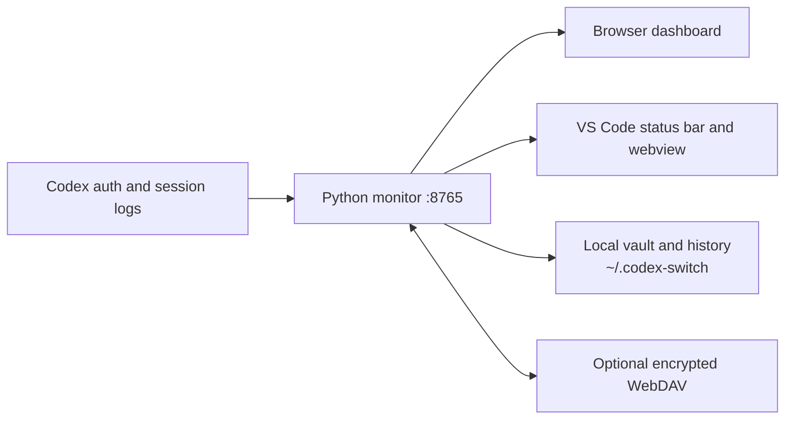

<div align="center">

# Codex Usage Monitor

**A local-first Codex quota, token, cost, account, skill, and encrypted-sync dashboard for VS Code.**

[](#quick-start)
[](https://www.python.org/)
[](https://code.visualstudio.com/)
[](#requirements)
[](https://www.gnu.org/licenses/gpl-3.0.html)

English · <a href="./README.zh-CN.md">简体中文</a>

</div>

Codex Usage Monitor combines the authoritative 5-hour and 7-day limits reported by the Codex service with locally parsed session tokens and estimated cost.
A lightweight Python service owns the data, dashboard, account vault, managed skills, and optional encrypted WebDAV synchronization; the VS Code extension adds a status-bar summary and opens the same live dashboard.

> [!IMPORTANT]
> The extension does not start the Python monitor. Start `python codex_monitor_daemon.py` first and keep it running.

## Why use it?

| Capability | What you get |
| --- | --- |
| Live quota monitoring | Authoritative 5-hour and 7-day percentages, reset times, plan-aware history curves, and lightweight five-second status refreshes. |
| Token and cost analytics | Fresh input, cached input, cache writes, output, cache-hit rate, per-model totals, Standard/Fast attribution, and estimated cost. |
| Multiple Codex accounts | Safe local account switching, login-slot creation, rename/delete controls, identity validation, and per-account history attribution. |
| Skill management | Discover Codex and Gemini skills, move them into one private managed store, assign them with strict links or managed fallbacks, and synchronize changes. |
| Encrypted multi-machine sync | AES-256-GCM WebDAV packages for copied API accounts, moved OpenAI accounts, and incremental usage journals with verified writes. |
| Local-first privacy | Credentials and raw recorder data stay under `~/.codex-switch`; dashboard payloads redact secrets and cloud-downloaded history never contaminates local recorder files. |
| Resilient operation | Atomic local writes, bounded incremental session-log scanning, revision-keyed response caches, conditional cloud updates, rollback-aware key rotation, and extensive unit coverage. |

## How it fits together


```mermaid
flowchart LR
    C[Codex auth and session logs] --> M[Python monitor :8765]
    M --> D[Browser dashboard]
    M --> V[VS Code status bar and webview]
    M --> L[Local vault and history<br/>~/.codex-switch]
    M <--> W[Optional encrypted WebDAV]
```

The monitor is authoritative. The dashboard receives complete, independent local and merged datasets from `/api/series` on its first connection, then polls `/api/status` every five seconds with an ETag. Local semantic changes are transferred as consecutive indexed patches for both views. Cloud supplemental-data changes replace the complete merged view because a cloud merge may revise historical points. A restart or missing retained index automatically recovers with another complete snapshot.

## Requirements

- Python 3.12 or newer on Windows and Linux.
- VS Code 1.96 or newer for the extension.
- A working Codex login in the normal `CODEX_HOME`.
- Port `8765` available.
- Python dependencies from `requirements.txt`—currently `cryptography>=46.0.0,<47` and `tomlkit>=0.13.3,<1`.
- Network/proxy access compatible with the environment variables recognized by Python and `monitor_common.py`.

## Quick start

### 1. Install the standalone runtime

Use the matching artifacts from `release/`:

1. Copy `release/runtime/` to a permanent location.
2. Open a terminal in that directory.
3. Install the dependency and start the monitor:

```console
python -m pip install -r requirements.txt
python codex_monitor_daemon.py --dashboard
```

Without `--dashboard`, the service starts normally but does not open a browser:

```console
python codex_monitor_daemon.py
```

### 2. Install the VS Code extension

Install `release/codex-usage-monitor-1.3.0.vsix` from VS Code:

1. Open **Extensions**.
2. Select **Views and More Actions (…) → Install from VSIX…**.
3. Choose the VSIX and reload VS Code if requested.

The command line is also supported:

```console
code --install-extension release/codex-usage-monitor-1.3.0.vsix
```

### 3. Complete first-run setup

1. Keep the Python monitor running.
2. Open `http://127.0.0.1:8765` or click the Codex status-bar item.
3. Create a control password when prompted. Initial setup is accepted only from the same computer, and `123456` is rejected.
4. Use **Manage skills & accounts** for account, skill, WebDAV, server, and configuration operations.

You now have local quota, token, cost, model, and account history. WebDAV is optional.

## Using the dashboard

The top cards show the latest 5-hour and 7-day usage, reset times, plan, and active account. The charts and selectors provide:

- **Date / 5h / 24h / 7d / 30d / All** time ranges.
- Model filters for token and cost analysis.
- Account filters shared by quota, token, and cost views.
- **Local** and **Merged** quota, token, and cost datasets.
- Separate colored quota curves per selected account.
- Fresh input, cached input, output, cache write, cache-hit rate, and estimated cost.

**Local** shows only quota, token, and cost data recorded by this machine. **Merged** extends each local account with synchronized records carrying the same private account identity.
Synchronized records that do not yet match a local account remain in the sync cache but are temporarily excluded; they are included automatically when the corresponding account is created or bound locally.
Merged datasets are materialized when local, synchronized, or account-identity data changes, so switching views only selects an existing dataset.

The extension contributes **Codex Usage Monitor: Show Details**. Opening it fetches the current dashboard, and invoking it again refreshes the same view. Webview status and history requests are independently deduplicated.

## Managing Codex accounts

The account vault lives in `~/.codex-switch/accounts`. On first startup, the current valid `auth.json` becomes **Current account**.

Codex exclusively owns refresh-token rotation for the active account. The monitor reloads and mirrors Codex's live `auth.json` before polling, uses its access token while valid, and pauses remote quota polling if Codex has not refreshed an expiring token yet. Ready inactive accounts are isolated from Codex and are polled every ten minutes; the monitor may rotate those credentials, reports failed inactive polls in the account selector, and never retries an ambiguous rotating-token exchange.

### Create and sign in to another account

1. Open **Manage skills & accounts**.
2. Choose **Create / login** and enter a local label.
3. The monitor securely saves the outgoing account and removes the live `auth.json`.
4. Run the normal Codex login in a new or restarted terminal.
5. The dashboard adopts the completed login automatically.

Restart existing Codex terminals after switching accounts because a running process may retain old credentials.

### Switch, rename, and delete

- **Switch** replaces only the live Codex `auth.json`; it never changes shared `config.toml`, sessions, prompts, MCP servers, or skills.
- **Rename** rewrites the local label across persisted monitor history.
- **Delete** is local-only and cannot delete the active account or the sole remaining local account.
- Before an outgoing signed-in account is saved, its live and vaulted `id_token` and `account_id` must match exactly.
- The same API key cannot occupy two ready local slots. Multiple normal OpenAI credential profiles may use the same authenticated account identity.

### Refresh after reset

Each normal account has a **Refresh after reset…** editor with independent 5h and 7d automation switches. The 5h automation can be limited to one or more daily time windows by painting the 24-hour bar in ten-minute steps or entering minute-precise start and end times; overlapping entries are merged and cross-midnight entries are split automatically. Leaving the list empty allows refresh all day.

The editor displays times in the browser's current time zone and shows the detected zone and UTC offset. On save, the browser converts each range to a fixed, timezone-free backend day position; the monitor stores neither the time zone nor its offset and compares those positions directly with the current timestamp. Any browser converts the saved positions through its own current offset for display. Consequently, switching users, travel, or daylight-saving changes can alter the displayed local hours without changing the saved execution windows. A 5h reset detected outside the allowed ranges remains queued until the next range opens, while 7d automation runs immediately after its reset.

### Transfer accounts between machines

Normal OpenAI accounts use move semantics:

- **Release** uploads and verifies the newest local account payload, then removes the local vault record.
- **Bind** downloads and integrity-checks a released payload, commits it locally, then removes and verifies removal of the cloud copy.

API accounts use copy semantics:

- **Share** uploads and verifies the API key, display name, and account-specific header settings while retaining the local copy.
- **Link** downloads and integrity-checks the API profile while retaining the cloud copy.
- API-key equality defines account equality. When the key already exists at the destination, the account is already shared or linked and no duplicate transfer action is shown.
- Later local name or header edits remain local; they do not create a second API account or automatically overwrite the other copy.

**Push** and **Fetch** never transfer account credentials. Local and cloud **Delete** actions remove only the selected copy, and Rename never mutates a cloud payload. At least one verified copy is preserved when a Bind or Release operation fails. Empty awaiting-login OpenAI slots can also be released and bound.

## Managing skills

The backend scans `CODEX_HOME/skills` and `~/.gemini/config/skills` for directories containing `SKILL.md`.

1. Open **Manage skills & accounts**.
2. Select **Scan skills** when you need a fresh discovery pass.
3. Select skills and choose **Manage selected**.
4. Assign each managed skill to Codex, Gemini, or both, and select **Shared** only for skills that should synchronize through WebDAV.

Managed content is moved into `~/.codex-switch/skills`.
The monitor creates strict per-skill symbolic links; Windows uses native directory junctions when symlinks are unavailable, while non-Windows systems use an ownership-marked managed copy as a fallback. Scanning preserves existing same-name target paths as unassigned conflicts; explicitly selecting **link to** replaces the conflicting path with the managed projection.

Newly managed skills are local-only by default. Existing managed skills retain their previous shared behavior when `skills.json` is upgraded. Cloud behavior is name-based for shared skills:

- **Push:** local same-name content wins, remote-only skills remain, and accounts are never included.
- **Fetch:** remote same-name shared content wins, local-only skills remain, and existing assignments are preserved.
- **Unshare / Unmanage:** publishes a durable tombstone so stale machines remove the shared skill instead of uploading it again. Unsharing keeps the managed source on the initiating machine; unmanaging keeps independent assigned copies.
- **Restore:** exact API restore creates a local safety ZIP before replacing the shared managed set; local-only managed skills remain untouched.

Changed shared skills and pending share-deletion tombstones receive independent two-minute stability windows. Stable content is uploaded automatically up to three times, with 30 seconds between failures.
The five-second observer hashes incrementally and performs a bounded full verification; disabling `skillsAutoUpload` disables this observation.

## Automatic runtime updates

Enable **Automatically update Codex Monitor** on the management Config page to check the published `release/runtime` manifest after startup and every hour. Checks run in the background. A newer verified runtime replaces only files named by the release manifest and then restarts the same entry command with the same arguments; failed checks leave the running installation unchanged. Python dependencies are not installed automatically.

## WebDAV and encrypted synchronization

Open **Manage skills & accounts → Config file**. Configure the remote without manually editing secrets unless recovery requires it.

| Setting | Purpose |
| --- | --- |
| Enabled | Turns WebDAV-backed features on or off. |
| Base URL | HTTPS WebDAV endpoint. Plain HTTP is allowed only for literal loopback development URLs. |
| Username / password | WebDAV credentials. The login password must remain locally recoverable because it is sent to the server. |
| Remote root | Isolated directory used by this application. |
| Encryption passphrase | Optional second-layer AES-256-GCM encryption. Every machine must use the same normalized URL, username, and passphrase. |
| Skills auto upload | Watches stable managed-skill changes and uploads only changed packages. |
| Usage data auto sync | Synchronizes the encrypted incremental usage journal every 60 minutes. |
| Allow optimistic writes | Permits servers that ignore conditional writes; account exclusivity then becomes best-effort. |

Use **Test WebDAV** before Push. Jianguoyun/Nutstore users can use `https://dav.jianguoyun.com/dav/` with an application password.

Manual and automatic WebDAV operations share a server-side queue and run one at a time. The management page shows a spinner and the running-plus-waiting count in the bottom-right corner. Click it to inspect operations or remove waiting work.
Share/Unshare Skill and Unmanage apply their local changes when execution starts, so removing waiting work prevents those changes too. Each operation has one queued/start notification and one outcome notification, including skipped, cancelled, and partially completed work.
The queue survives page reloads and closed tabs, but waiting operations are discarded when the monitor stops. Targets and configuration are revalidated before execution. Identical adjacent sync requests and compatible automatic skill uploads can share work; other actions retain their order.

Queued management POSTs return HTTP `202` with `operationId` and `sessionId`. Authenticated clients read progress and recent results from `GET /api/manage/cloud/queue` and remove waiting work with `POST /api/manage/cloud/queue/cancel` and an `operationId` JSON field.

Manual **Push** always publishes managed-skill changes and local recorded usage data. Manual **Fetch** always refreshes remote-account metadata, merges managed-skill changes, and downloads recorded usage data from other machines. These manual transfers run even when their automatic options are disabled. Account credentials are transferred only through explicit **Share**, **Link**, **Release**, and **Bind** actions.

The encryption passphrase is converted with scrypt and immediately cleared from the staging field. Its deterministic salt is derived from the normalized WebDAV URL and username so another machine can derive the same key.
Changing an existing passphrase downloads, authenticates, re-encrypts, uploads, and verifies every known encrypted object; local configuration is committed only after the whole remote rotation succeeds, and partial remote writes are rolled back on failure.

If authentication works but decryption fails, the management page can reload local configuration and retry or overwrite the inaccessible cloud root from local data. Overwrite permanently removes cloud-only skills, released accounts, and usage history.

### Usage-data synchronization

Automatic usage synchronization supplements the directional manual Push and Fetch actions:

- It runs every 60 minutes when `usageDataAutoSync` is enabled. The one-hour interval is measured from the last attempted sync, so both successful and failed attempts delay the next attempt by one hour.
- It synchronizes quota history and every event-level token-ledger record. Cost/usage chart points and token-session summaries are rebuilt locally and are never synchronized.
- Local quota history keeps every accepted poll. Cloud synchronization removes only redundant interior samples from unchanged quota plateaus and marks the retained endpoint with the covered range;
  gaps over four hours remain separate and unmarked so charts can distinguish compaction from a real monitoring outage.
- It excludes credentials, skill contents, detailed sample logs, and runtime state.
- Each machine publishes an encrypted manifest containing every logical usage-pack ID and content hash. Fetch compares that complete inventory with `usage_monitor_sync_cache.json`, so one known pack can never cause earlier or missing packs to be skipped.
- Records are assigned to 64 key-hash buckets and subdivided by additional hash bits when a pack exceeds 16 KiB compressed; an indivisible oversized record stays in its own pack. Changes remain within the affected hash branch; full Push keeps the same compacted quota dataset and forces upload and verification.
- Ordinary publishing verifies at most two deterministically rotated changed packs and commits the manifest with a strong conditional ETag. It does not list the pack directory.
  A full verification reads every referenced pack and verifies the committed pointer every 30 days, on format migration, and for an explicit full Push.
- A failed upload cannot expose a partial manifest: immutable content-addressed packs are uploaded first, and the pointer is committed last with `If-Match`/`If-None-Match`.
  A later attempt can reuse packs left by a failure before retrying the pointer commit.
- Fetch reads legacy checkpoint/chunk streams while retaining quota records and ignoring obsolete derived cost/session records. Current packs are published through a conditional manifest commit.
- Downloaded records are stored in immutable pack shards under `usage_monitor_sync_cache.json.d/`; `usage_monitor_sync_cache.json` is the small manifest committed after its shards are durable. Fetch reconciles removed machine origins after reading the complete remote inventory.
- Usage account IDs are domain-separated hashes of account identity and stay unchanged when the encryption passphrase changes. Compatible legacy aliases keep older synchronized records associated with their account.
- The dashboard maintains `usage_monitor_dashboard_cache.json` as a display-only cache of complete local and merged chart datasets. It keeps the newest three days lossless and progressively groups older chart points; raw recorder files and token/session totals are not changed. Cache build timestamps and hourly maintenance deadlines do not publish an API update unless the visible data changes.

Every 60 minutes, periodic Fetch also checks the authoritative skill index and refreshes the remote-account list. Strong pointer ETags skip unchanged usage manifests, while missing local pack hashes still force repair.
Every 30 days a full fetch verifies all active remote packs. The first periodic Fetch runs immediately when no previous attempt is recorded or when the recorded attempt is at least one hour old.

## Data and privacy

The canonical data root is `~/.codex-switch`:

| Path | Contents | Cloud synchronized? |
| --- | --- | --- |
| `config.json` | Server and auto-update settings, plaintext WebDAV login password, cookie secret, password verifier, and derived encryption key | No |
| `accounts/` | Sensitive Codex account vault and manifest | Explicit API Share/Link or OpenAI Release/Bind only |
| `skills/` | Private managed skill source | Optional encrypted packages |
| `usage_monitor_quota_readings.jsonl` | Complete local accepted quota readings | Compacted derived records only |
| `usage_monitor_token_events.jsonl` | Append-only usage events with recorded costs and preserved legacy token baselines; authoritative for token and cost totals | Every record, encrypted |
| `usage_monitor_diagnostic_samples.jsonl` | Detailed local diagnostic samples | Never |
| `usage_monitor_state.json` | Runtime baselines and cursors | Never |
| `usage_monitor_sync_cache.json` / `usage_monitor_sync_cache.json.d/` | Atomic cache manifest and immutable downloaded pack shards | Never uploaded as recorder files |
| `usage_monitor_dashboard_cache.json` | Backend-maintained complete local/merged display snapshots with tiered chart points | Never |

Each token event stores its cost calculated using the price effective at the event time. Stored costs remain authoritative after pricing changes; redundant price-epoch records and references are removed by the ordered data-contract migration after verifying totals. Existing session-only totals are preserved as legacy baselines, which contribute to token summaries but not Cost vs Usage charts. Legacy source high-water totals are retained when they cannot be derived equivalently from the baseline.

Derived charts are rebuilt from retained quota history and token-ledger events; obsolete cost-chart records are not converted. Local quota and ledger entries are appended and flushed to disk, runtime state is atomically replaced, and interrupted migrations recover before affected data is loaded.

> [!WARNING]
> Protect the whole `~/.codex-switch` directory. Never commit it, place it in support bundles, log it, or share screenshots of its contents. Losing the encryption passphrase makes encrypted remote data unrecoverable.

Dashboard series and status are intentionally readable from the configured server address. Every account, skill, WebDAV, cloud, server, and configuration mutation requires the control password.
Control requests are accepted through public addresses and reverse proxies without an origin restriction so cloud deployments retain all dashboard features.

First-time control-password setup is loopback-only. If you do not need LAN or WAN access, change the server host to `127.0.0.1` and restart the monitor.
The default `0.0.0.0` listens on all interfaces and permits full password-protected dashboard use through the request's LAN or public IP address when the network routes port 8765 to the monitor.
Direct public-IP access uses unencrypted HTTP, so prefer a trusted VPN or an HTTPS reverse proxy rather than exposing port 8765 directly to the Internet.

## Command-line reference

```console
python codex_monitor_daemon.py --help
```

| Option | Description |
| --- | --- |
| `--dashboard` | Open the dashboard after the server starts. |
| `--codex-home PATH` | Use a different Codex home containing `sessions/` and usually `auth.json`. |
| `--auth PATH` | Override the live authentication file. |
| `--interval SECONDS` | Set the remote usage polling interval; default is 90 seconds. |
| `--timeout SECONDS` | Set the per-request timeout; default is 10 seconds. |
| `--quota-history PATH` | Override per-account quota-history JSONL. |
| `--token-ledger PATH` | Override the append-only token and recorded-cost ledger JSONL. |
| `--sample-log PATH` | Override the detailed diagnostic JSONL. |
| `--sample-log-max-bytes N` | Compact the sample log after this size; default is 50 MiB with an 80% target. |
| `--local-only` | Scan local session logs without calling ChatGPT usage endpoints. |
| `--no-token-scan` | Disable local session token scanning. |
| `--compact-history-days N` | Keep only quota history newer than N days. |
| `--reencrypt-cloud` | Refresh nonces and verify all encrypted WebDAV payloads using the configured key, then exit. |
| `--retry-limit N` | Set bounded HTTP/dashboard retries; network outages continue retrying. |

## Troubleshooting

### The VS Code status bar cannot connect

- Confirm `python codex_monitor_daemon.py` is still running.
- Confirm `http://127.0.0.1:8765/api/status` opens locally.
- Check whether another process owns port `8765`.
- The extension always connects to `127.0.0.1:8765`, even when the server also listens on the LAN.

### The dashboard is waiting for login

- Complete the normal Codex login in a new or restarted terminal.
- Confirm the expected `CODEX_HOME/auth.json` exists.
- Do not manually copy credentials between managed account slots.

### A control password is reported as compromised

A legacy nonempty `passwordHash` without its separate valid `passwordSalt` is rejected. Stop the monitor, remove only `control.passwordHash` from `~/.codex-switch/config.json`, restart, and create a new password locally. Do not reuse `123456`.

### WebDAV authentication works but encrypted data does not open

- Verify the normalized base URL, username, remote root, and passphrase match the other machine.
- Reload configuration and retry before choosing overwrite.
- Treat overwrite as destructive to cloud-only data.

### A skill cannot be assigned

- Inspect the target application's skill folder and the projection state shown in skill management.
- Selecting **link to** replaces any existing same-name target skill; scanning alone reports the conflict without replacing it or recording a projection error.
- On Windows, ensure the account can create a symlink or native junction at the target.

## Development

Run from the repository root:

```console
python -m pip install -r requirements.txt
python -m unittest discover -p "test_*.py"
npm run check
python codex_monitor_daemon.py --help
```

Build a reproducible deployment bundle:

```console
python build_release.py
```

or:

```console
npm run release
```

The builder increments the patch version in `package.json`, recreates generated files in `release/`, packages the pinned VSCE version, copies the standalone runtime and GPL license, removes obsolete versioned VSIX files, and creates `release_pack/code-monitor-v<VERSION>.zip`.
Credentials, local history, caches, tests, reference sources, and development-only material are excluded.

### Repository layout

| Path | Responsibility |
| --- | --- |
| `codex_monitor_daemon.py` | Canonical CLI entry point, monitor startup, automatic update coordination, and restart. |
| `monitor_codex_usage.py` | Compatibility wrapper for the former entry command. |
| `monitor_auto_update.py` | Verified background runtime updater. |
| `monitor_dashboard.py` | Polling loops, dashboard/API server, response caches, control authorization, and UI datasets. |
| `monitor_accounts.py` | Local credential vault, identity-safe switching, API copy transfer, and OpenAI move transfer. |
| `monitor_cloud.py` | Configuration, WebDAV, encryption, serialized cloud operations, packages, and usage journal. |
| `monitor_skills.py` | Skill discovery, managed storage, validation, assignments, and projections. |
| `monitor_tokens.py` | Incremental session-log parsing, token aggregation, Fast attribution, and cost calculation. |
| `monitor_token_ledger.py` | Append-only token/cost ledger, compact legacy baseline migration, and derived session totals. |
| `monitor_events.py` / `monitor_quota.py` | Remote usage interpretation, reset handling, and delta validation. |
| `monitor_history.py` / `monitor_usage_sync.py` | Local persistence, compaction, provenance, synchronized cache, and merged datasets. |
| `extension.js` / `package.json` | Thin VS Code extension host and manifest. |
| `dashboard.html` / `management.html` | Local user interfaces. |
| `build_release.py` | Reproducible VSIX and standalone-runtime builder. |

## License

Codex Usage Monitor is free software licensed under the <a href="./LICENSE">GNU General Public License version 3</a>.
