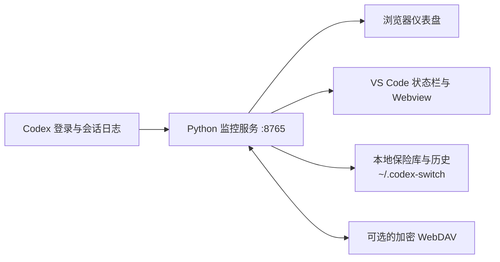

<div align="center">

# Codex Usage Monitor

**一个本地优先的 Codex 配额、Token、成本、账号、技能与加密同步仪表盘，并提供 VS Code 集成。**

[](#快速开始)
[](https://www.python.org/)
[](https://code.visualstudio.com/)
[](#运行要求)
[](https://www.gnu.org/licenses/gpl-3.0.html)

<a href="./README.md">English</a> · 简体中文

</div>

Codex Usage Monitor 将 Codex 服务返回的权威 5 小时和 7 天额度，与本地会话日志解析出的 Token 和预估成本整合到同一个界面。轻量级 Python 服务负责数据、仪表盘、账号保险库、托管技能及可选的 WebDAV 加密同步；VS Code 扩展则提供状态栏摘要并打开同一个实时仪表盘。

> [!IMPORTANT]
> VS Code 扩展不会自动启动 Python 监控服务。请先运行 `python monitor_codex_usage.py`，并保持进程运行。

## 为什么使用它？

| 能力 | 你将获得 |
| --- | --- |
| 实时额度监控 | 权威的 5 小时与 7 天使用百分比、重置时间、按套餐处理的历史曲线，以及轻量的五秒状态刷新。 |
| Token 与成本分析 | 新鲜输入、缓存输入、缓存写入、输出、缓存命中率、按模型统计、Standard/Fast 归因和预估成本。 |
| 多 Codex 账号 | 安全的本地账号切换、登录槽创建、重命名与删除、身份一致性校验，以及按账号归因的历史。 |
| 技能管理 | 发现 Codex 和 Gemini 技能，将其移动到统一的私有托管目录，使用严格链接或托管回退进行分配，并同步变更。 |
| 多机加密同步 | 通过 WebDAV 保存 AES-256-GCM 加密技能包、仅移动式账号传输和增量使用记录。 |
| 本地优先隐私 | 凭据与原始记录保留在 `~/.codex-switch`；仪表盘接口会脱敏，云端下载的历史不会污染本地记录文件。 |
| 稳健运行 | 原子本地写入、增量会话日志扫描、基于修订版本的响应缓存、条件云端更新、可回滚的密钥轮换，以及完整的单元测试。 |

## 工作方式



Python 监控服务是权威数据源。扩展在可见时轮询 `/api/status`，仅在修订版本变化后重新读取 `/api/series`；只有无法获取实时页面时，才使用扩展内置的仪表盘。

## 运行要求

- Windows 或 Linux 上的 Python 3.12 或更高版本。
- 使用扩展时需要 VS Code 1.96 或更高版本。
- 正常 `CODEX_HOME` 中已有可用的 Codex 登录。
- 端口 `8765` 未被占用。
- 安装 `requirements.txt` 中的依赖；目前为 `cryptography>=46.0.0,<47`。
- 网络和代理配置能被 Python 及 `monitor_common.py` 正确识别。

## 快速开始

### 1. 安装独立运行时

请使用 `release/` 中版本一致的文件：

1. 将 `release/runtime/` 复制到固定位置。
2. 在该目录打开终端。
3. 安装依赖并启动监控：

```console
python -m pip install -r requirements.txt
python monitor_codex_usage.py --dashboard
```

不使用 `--dashboard` 时，服务仍会正常启动，但不会自动打开浏览器：

```console
python monitor_codex_usage.py
```

### 2. 安装 VS Code 扩展

在 VS Code 中安装 `release/codex-usage-monitor-1.0.0.vsix`：

1. 打开 **扩展**。
2. 选择 **视图和更多操作 (…) → 从 VSIX 安装…**。
3. 选择 VSIX；若 VS Code 提示，请重新加载窗口。

也可以使用命令行：

```console
code --install-extension release/codex-usage-monitor-1.0.0.vsix
```

### 3. 完成首次设置

1. 保持 Python 监控服务运行。
2. 打开 `http://127.0.0.1:8765`，或点击 Codex 状态栏项目。
3. 根据提示创建控制密码。首次设置只接受本机请求，并拒绝使用 `123456`。
4. 通过 **Manage skills & accounts** 管理账号、技能、WebDAV、服务器和配置。

到这里，本地额度、Token、成本、模型和账号历史已经可以使用；WebDAV 完全可选。

## 使用仪表盘

顶部卡片显示最新的 5 小时和 7 天使用量、重置时间、套餐和当前账号。图表与选择器提供：

- **Date / 5h / 24h / 7d / 30d / All** 时间范围。
- 用于 Token 与成本分析的模型筛选。
- 由额度、Token 和成本视图共享的账号筛选。
- **Local** 与 **Merged** Token/成本数据集。
- 每个选中账号独立着色的额度曲线。
- 新鲜输入、缓存输入、输出、缓存写入、缓存命中率和预估成本。

Local/Merged 选择器控制 Token 与成本数据。额度曲线始终使用合并后的额度历史，因为服务端额度百分比由多台机器共享，不应显示成某一台机器独占的消耗。

扩展提供 **Codex Usage Monitor: Show Details** 命令。打开时会获取当前仪表盘，再次执行会刷新同一个视图；Webview 的状态与历史请求会分别去重。

## 管理 Codex 账号

账号保险库位于 `~/.codex-switch/accounts`。第一次启动时，当前有效的 `auth.json` 会保存为 **Current account**。

### 创建并登录另一个账号

1. 打开 **Manage skills & accounts**。
2. 选择 **Create / login**，输入本地显示名称。
3. 监控服务会安全保存当前账号并移除实时 `auth.json`。
4. 在新建或重启的终端中执行正常的 Codex 登录。
5. 仪表盘会自动接管完成的登录。

切换账号后请重启已有的 Codex 终端，因为运行中的进程可能继续持有旧凭据。

### 切换、重命名与删除

- **Switch** 只替换实时 Codex `auth.json`，不会修改共享的 `config.toml`、会话、提示词、MCP 服务器或技能。
- **Rename** 会同步重写已保存监控历史中的本地标签。
- **Delete** 仅影响本机，并且不能删除当前账号或唯一剩余的本地账号。
- 保存已登录的离开账号前，实时与保险库中的 `id_token` 和 `account_id` 必须完全一致。
- 同一个已认证身份不能占用两个可用的本地槽位。

### 在机器之间移动账号

账号云存储采用“移动”而非“备份”语义：

- **Release** 上传并验证最新本地账号文件，成功后才删除本地保险库记录。
- **Bind** 下载并校验已释放文件，提交到本地后才删除并验证云端副本。
- **Push** 与 **Fetch** 永远不会上传本地账号凭据。
- **Rename** 与 **Delete** 永远不会修改云端账号文件。

Bind 或 Release 失败时会至少保留一份已验证副本。等待登录的空槽也可以正常 Release 和 Bind。

## 管理技能

后端会扫描 `CODEX_HOME/skills` 与 `~/.gemini/config/skills` 下包含 `SKILL.md` 的目录。

1. 打开 **Manage skills & accounts**。
2. 需要重新发现时选择 **Scan skills**。
3. 选中技能并执行 **Manage selected**。
4. 将每个托管技能分配给 Codex、Gemini 或两者。

托管内容会移动到 `~/.codex-switch/skills`。监控服务优先创建严格的逐技能符号链接；Windows 无法创建符号链接时使用原生目录联接，非 Windows 平台则使用带所有权标记的托管副本作为回退。无关的已有路径会作为冲突保留。

云端行为按技能名称合并：

- **Push：** 本地同名内容优先，保留云端独有技能，绝不包含账号。
- **Fetch：** 云端同名内容优先，保留本地独有技能，并保留现有分配。
- **Unmanage：** 配置云同步后会立即发布该技能的删除墓碑。
- **Restore：** 精确 API 恢复会先创建本地安全 ZIP，再替换托管集合。

每个被修改的托管技能都有独立的两分钟稳定窗口。稳定后最多自动上传三次，失败间隔 30 秒。五秒观察器会增量复用哈希并定期进行完整验证；关闭 `skillsAutoUpload` 也会关闭该观察。

## WebDAV 与加密同步

打开 **Manage skills & accounts → Config file**。除非执行恢复操作，否则建议通过界面配置远端而不是直接编辑秘密字段。

| 设置 | 用途 |
| --- | --- |
| Enabled | 启用或关闭 WebDAV 云端功能。 |
| Base URL | HTTPS WebDAV 地址；明文 HTTP 只允许字面量回环开发地址。 |
| Username / password | WebDAV 凭据。登录密码必须能在本地恢复，因为需要发送给服务器。 |
| Remote root | 本应用使用的隔离远端目录。 |
| Encryption passphrase | 可选的第二层 AES-256-GCM 加密；每台机器必须使用相同的规范化 URL、用户名和口令。 |
| Skills auto upload | 观察稳定的托管技能变化，并只上传发生变化的包。 |
| Usage data auto sync | 每 30 分钟同步一次加密的增量使用记录。 |
| Allow optimistic writes | 兼容忽略条件写入的服务器；此时账号独占只能尽力保证。 |

Push 前请先执行 **Test WebDAV**。坚果云用户可以使用 `https://dav.jianguoyun.com/dav/` 与应用密码。

加密口令会通过 scrypt 转换，并立即从暂存字段清除。确定性盐由规范化后的 WebDAV URL 和用户名生成，使另一台机器能够派生同一个密钥。修改已有口令时，程序会下载、认证、重新加密、上传并验证所有已知加密对象；只有整个远端轮换成功后才提交本地配置，失败时会回滚已经写入的远端对象。

如果 WebDAV 认证成功但解密失败，管理页可以重新加载本地配置并重试，也可以用本地数据覆盖无法访问的云端根目录。覆盖会永久删除仅存在于云端的技能、已释放账号和使用历史。

### 使用数据同步

使用数据同步与技能 Push 相互独立：

- 启用 `usageDataAutoSync` 后每 30 分钟执行一次。
- 同步成本/百分比区间、额度历史和 Token 会话历史。
- 不同步凭据、技能内容、详细样本日志和运行状态。
- 使用不可变加密块、检查点、ETag 与墓碑实现增量和可重试更新。
- 下载的数据按来源保存到 `usage_monitor_sync_cache.json`，绝不替换或追加到本地记录文件。

每五分钟的周期 Fetch 还会检查权威技能索引并刷新已释放账号列表。指针未变化且包哈希一致时不会重复下载。

## 数据与隐私

规范的数据根目录为 `~/.codex-switch`：

| 路径 | 内容 | 是否同步到云端 |
| --- | --- | --- |
| `config.json` | 服务器设置、明文 WebDAV 登录密码、Cookie 密钥、密码校验值和派生加密密钥 | 否 |
| `accounts/` | 敏感 Codex 账号保险库与清单 | 仅通过显式 Release/Bind 移动 |
| `skills/` | 私有托管技能源 | 可选的加密技能包 |
| `usage_monitor_history.jsonl` | 本地原始成本/百分比区间 | 仅同步派生记录 |
| `usage_monitor_quota_history.jsonl` | 本地压缩额度读数 | 仅同步派生记录 |
| `usage_monitor_token_sessions.jsonl` | 本地逐会话 Token 与成本 | 仅同步派生记录 |
| `usage_monitor_samples.jsonl` | 本地详细诊断样本 | 永不 |
| `usage_monitor_state.json` | 运行基线和游标 | 永不 |
| `usage_monitor_sync_cache.json` | 按来源保存的下载记录 | 不作为记录文件上传 |

> [!WARNING]
> 请保护整个 `~/.codex-switch`。不要提交到仓库、放入支持包、写入日志或分享其内容截图。丢失加密口令后，远端加密数据将无法恢复。

仪表盘序列与状态按配置的服务器地址开放读取。所有账号、技能、WebDAV、云端、服务器与配置修改都必须通过控制密码认证；首次设置控制密码只允许本机。如果不需要局域网访问，请将服务器地址改为 `127.0.0.1` 并重启；默认 `0.0.0.0` 会监听所有网络接口。

## 命令行参考

```console
python monitor_codex_usage.py --help
```

| 参数 | 说明 |
| --- | --- |
| `--dashboard` | 服务启动后自动打开仪表盘。 |
| `--codex-home PATH` | 使用另一个包含 `sessions/`，通常也包含 `auth.json` 的 Codex 主目录。 |
| `--auth PATH` | 覆盖实时认证文件。 |
| `--interval SECONDS` | 设置远端额度轮询间隔，默认 90 秒。 |
| `--timeout SECONDS` | 设置单次请求超时，默认 10 秒。 |
| `--history PATH` | 覆盖本地成本区间历史 JSONL。 |
| `--quota-history PATH` | 覆盖逐账号额度历史 JSONL。 |
| `--token-session-history PATH` | 覆盖逐会话 Token/成本 JSONL。 |
| `--sample-log PATH` | 覆盖详细诊断 JSONL。 |
| `--sample-log-max-bytes N` | 超过该大小后压缩样本日志；默认 50 MiB，压缩目标为 80%。 |
| `--local-only` | 只扫描本地会话日志，不访问 ChatGPT 使用量接口。 |
| `--no-token-scan` | 禁用本地会话 Token 扫描。 |
| `--process-history` | 输出已保存的有效成本/百分比数据后退出。 |
| `--compact-history-days N` | 只保留最近 N 天的成本与额度历史后退出。 |
| `--reencrypt-cloud` | 使用当前密钥刷新随机数并验证所有 WebDAV 加密对象后退出。 |
| `--retry-limit N` | 设置有限的 HTTP/仪表盘重试次数；网络断线仍会持续重试。 |

## 常见问题

### VS Code 状态栏无法连接

- 确认 `python monitor_codex_usage.py` 仍在运行。
- 确认本机可以打开 `http://127.0.0.1:8765/api/status`。
- 检查是否有其他进程占用 `8765`。
- 即使服务器同时监听局域网，扩展也始终连接 `127.0.0.1:8765`。

### 仪表盘一直等待登录

- 在新建或重启的终端中完成正常 Codex 登录。
- 确认预期的 `CODEX_HOME/auth.json` 存在。
- 不要在托管账号槽之间手工复制凭据。

### 控制密码被报告为已泄露或无效

旧配置中若存在非空 `passwordHash` 却没有单独且有效的 `passwordSalt`，程序会拒绝使用。停止监控服务，只删除 `~/.codex-switch/config.json` 中的 `control.passwordHash`，重启，然后在本机创建新密码。不要使用 `123456`。

### WebDAV 可以认证，但无法打开加密数据

- 确认规范化 Base URL、用户名、远端根目录和口令与另一台机器一致。
- 选择覆盖前，先重新加载配置并重试。
- 覆盖会删除仅存在于云端的数据，请按破坏性操作处理。

### 技能无法分配

- 执行 **Scan skills** 并检查报告的投影冲突。
- 自行移动或重命名无关的已有路径；监控服务不会覆盖它。
- Windows 上请确认当前账号能够在目标位置创建符号链接或原生目录联接。

## 开发

在仓库根目录运行：

```console
python -m pip install -r requirements.txt
python -m unittest test_monitor_codex_usage.py
npm run check
python monitor_codex_usage.py --help
```

构建可复现的部署包：

```console
python build_release.py
```

或：

```console
npm run release
```

构建器会重建 `release/` 中的生成文件，使用固定版本 VSCE 打包扩展，复制独立运行时与 GPL 许可证，删除旧版本 VSIX，并排除凭据、本地历史、缓存、测试、参考源码和仅用于开发的资料。

### 仓库结构

| 路径 | 职责 |
| --- | --- |
| `monitor_codex_usage.py` | CLI 入口与监控服务启动。 |
| `monitor_dashboard.py` | 轮询循环、仪表盘/API 服务、响应缓存、控制认证与 UI 数据集。 |
| `monitor_accounts.py` | 本地凭据保险库、身份安全切换与仅移动式账号传输。 |
| `monitor_cloud.py` | 配置、WebDAV、加密、串行云操作、软件包与使用记录。 |
| `monitor_skills.py` | 技能发现、托管存储、验证、分配与投影。 |
| `monitor_tokens.py` | 增量会话日志解析、Token 聚合、Fast 归因与成本计算。 |
| `monitor_events.py` / `monitor_quota.py` | 远端使用量解释、重置处理与增量校验。 |
| `monitor_history.py` / `monitor_usage_sync.py` | 本地持久化、压缩、来源信息、同步缓存与合并数据集。 |
| `extension.js` / `package.json` | 轻量 VS Code 扩展宿主与清单。 |
| `dashboard.html` / `management.html` | 本地用户界面。 |
| `build_release.py` | 可复现 VSIX 与独立运行时构建器。 |

## 许可证

Codex Usage Monitor 是基于 <a href="./LICENSE">GNU General Public License version 3</a> 发布的自由软件。
