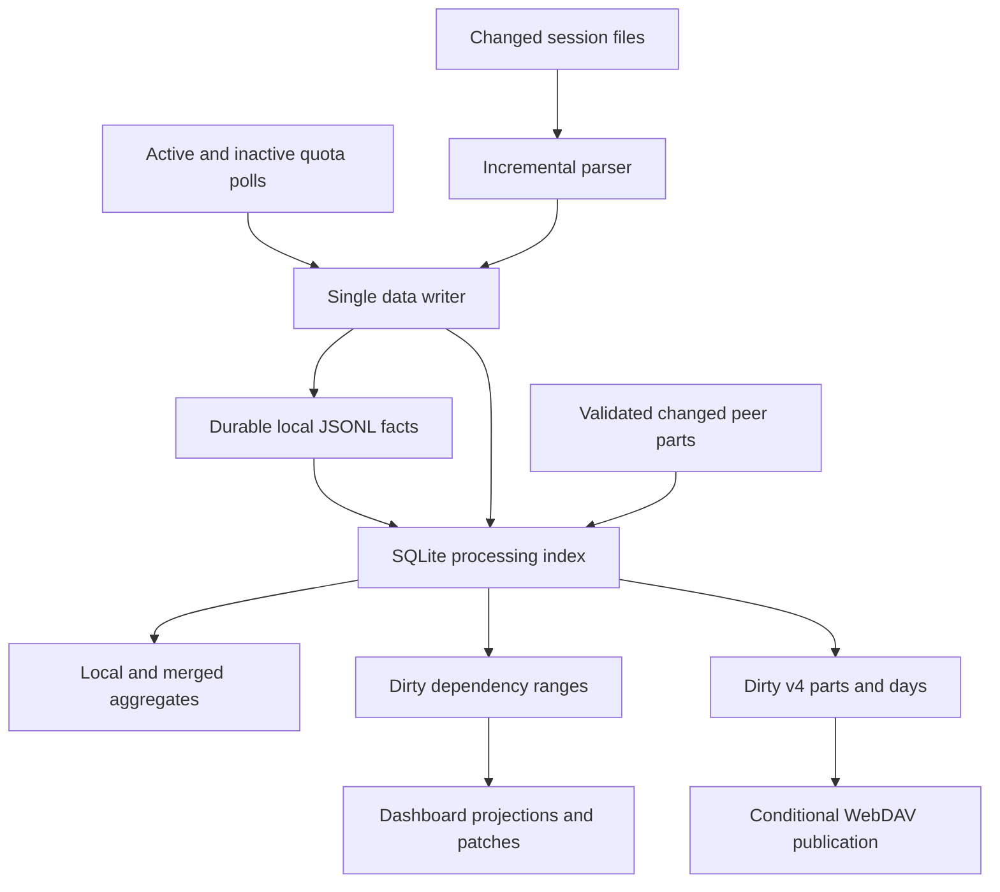

# Incremental processing design for Codex Usage Monitor

Design only. Prepared on 2026-10-02 against the current working tree, including its existing uncommitted changes. No runtime code, tests, package metadata, or packaged files are changed by this proposal.

## 1. Recommended design and scope

Make capture, normalization, aggregation, dashboard generation, and WebDAV publication consume explicit changes. Extend the existing SQLite v4 database into a persistent processing index instead of rebuilding Python lists of complete datasets.

Keep the existing local quota and token JSONL files as durable facts and keep the WebDAV v4 wire format. SQLite holds indexed representations, scan checkpoints, aggregates, dependency state, and pending work.
Existing collection-period assignments and validated peer records remain durable metadata; they must survive an index rebuild. The database contains both durable metadata and rebuildable tables, so deleting the whole database is not a recovery strategy.

The design preserves current token identities, account attribution, pricing rules, quota-continuity rules, conflict resolution, and dashboard series semantics. It changes how those results are calculated and retained in memory.

A full history rebuild is permitted during the initial migration, explicit repair, or recovery of invalid derived state. Normal polling must never perform a global history rebuild just because a timer fired.

Quota processing has an important exception: the existing continuity algorithm uses an account-wide percentile and retrospective decisions. A changed percentile can legitimately require replay of an entire account/window history.
This proposal preserves that behavior and makes the replay explicit, scoped, observable, and independent of raw history rereads. It does not claim that every possible new quota sample can be handled in constant time.

## 2. Current sources of repeated work

| Path | Current repeated work | Replacement |
| --- | --- | --- |
| Session discovery and scanning | Enumerate all session files; process every cached token event; rebuild totals and sessions | Changed-file queue, persistent parser state, event batches, stored totals |
| Token ledger synchronization | Read the whole ledger; recreate usage records; reconcile all records; rebuild session summaries | Indexed event lookup, append new rows, reconcile only changed sources |
| Active-account polling | Normalize both complete datasets after each sample | Normalize and commit the new records once |
| Inactive-account polling | Repeat complete normalization after polling a batch of accounts | Submit the new quota rows through the same writer |
| Startup diagnostic backfill | Read diagnostic samples and quota history again | Migration/import checkpoint; process new diagnostic content only when explicitly needed |
| Local/merged dataset materialization | Load peer records, merge lists, and sort histories | Indexed winners and projections for changed logical keys |
| Dashboard cache | Derive quota points, sessions, and cost series from complete datasets | Persistent series rows with dependency-aware updates |
| v4 publication | Rebuild all local envelopes and day hashes, including unchanged days | Dirty part/day/month queues and cached publication metadata |
| Peer download application | Rematerialize complete local/merged datasets after applying a day | Diff the changed peer part/day and apply only logical changes |
| Retention | Read/filter/rewrite quota history on the polling path | Indexed expiry selection and scheduled physical compaction |

Relevant current implementations:

- [Session scanning](</D:/Workspace/codex_monitor/monitor_tokens.py:354>) and [historical event reconstruction](</D:/Workspace/codex_monitor/monitor_tokens.py:411>).
- [Ledger reconciliation](</D:/Workspace/codex_monitor/monitor_token_ledger.py:218>).
- [Dataset normalization](</D:/Workspace/codex_monitor/monitor_usage_sync.py:714>) and [v4 snapshot construction](</D:/Workspace/codex_monitor/monitor_usage_sync.py:895>).
- [Quota continuity](</D:/Workspace/codex_monitor/monitor_dashboard.py:311>), [dashboard derivation](</D:/Workspace/codex_monitor/monitor_dashboard.py:696>), and [polling](</D:/Workspace/codex_monitor/monitor_dashboard.py:1160>).
- [Cloud publication](</D:/Workspace/codex_monitor/monitor_cloud.py:1884>) and [migration framework](</D:/Workspace/codex_monitor/monitor_auto_update.py:447>).

## 3. Processing invariants

1. New records are canonicalized, validated, attributed, and hashed once when they enter the pipeline.
2. Unchanged records do not generate writes, revision changes, dashboard patches, or outbound dirty work.
3. Replaying a batch produces the same logical facts and totals as processing it once.
4. Source checkpoints never advance past data whose durable recording and indexed application have completed.
5. Every replacement or deletion removes its previous contribution before adding the new contribution.
6. Raw session-file disappearance or archival does not delete already recorded token usage.
7. Local and merged views use the same existing logical identities and conflict rules; peer ownership is retained.
8. A record's existing v4 collection period remains fixed through corrections and restarts.
9. Partial writes, invalid input, interrupted migrations, and failed downloads preserve the previous verified state.
10. Display compaction never replaces or discards canonical historical facts.
11. No successful measurement is discarded merely because its quota percentages match the previous measurement; timestamps and continuity remain meaningful.
12. Background operations have bounded working sets, explicit reasons, and cancellation/resume behavior.

## 4. Architecture and responsibilities

One writer serializes logical data mutations from active polling, inactive polling, account operations, imports, and cloud downloads. HTTP readers and the dashboard projector read committed generations.

Network calls, raw-file reading, compression, and encryption happen outside the main dashboard lock. Short writer transactions and atomic publication of completed projection generations replace long critical sections around whole histories.

The single writer may be a dedicated worker with a bounded queue. Producers enqueue batches, not one task per record. Repeated dirty requests for the same scope coalesce. Required data ingestion is never silently dropped when the queue is full.

### Proposed internal interfaces

- `scan_changes()` returns new events, source replacements, scan-status changes, and tentative parser checkpoints. It does not return all historical events.
- `apply_local_batch()` canonicalizes new local rows and durably applies additions/replacements/deletions and source checkpoints.
- `apply_remote_part()` validates a peer update and computes its changed logical keys.
- `apply_record_changes()` produces exact before/after contributions, touched sessions/accounts, and affected time ranges.
- `read_totals()`, `read_session_page()`, and `read_series_range()` query indexed projections.
- `claim_dirty_work()` and `complete_dirty_work()` track work against a committed input generation.

The existing full-scan functions remain available as repair tools and correctness references. Normal runtime callers stop requesting complete `events`, `sessions`, or `datasets` lists.

## 5. Persistent index and state

Extend the existing SQLite file with an ordered schema migration. Keep its current local period assignments, remote days, remote records, origins, and metadata intact.

| State/table family | Purpose and indexing |
| --- | --- |
| Source checkpoints | Source path, file identity/generation, size/mtime, committed byte offset, parser version, verification fingerprints, scan health |
| Parser state | Session identity, fork-history flag, model/tier, previous cumulative totals, line/event indexes, partial-line state, legacy-coverage progress |
| Source occurrences | Source generation and occurrence position mapped to the existing stable event ID; supports duplicate copies and source replacement |
| Indexed local facts | Existing record JSON and content hash, kind, owner, logical key, account, session, model/tier, timestamp, file position |
| Local v4 assignments | Existing key-to-period mapping plus dirty/publication generations; period does not change during an update |
| Peer facts and manifests | Existing validated peer data and logical hashes, preserving unknown bounded record kinds |
| Effective records | Winning local/merged records under the current merge rules; physical owner keys remain separate from logical merge keys |
| Token aggregates | Raw scan totals and ledger/session/account/model/tier totals, maintained separately because legacy coverage affects ledger totals |
| Quota state | Ordered points per view/account/window, adjacency rates, exact rate distribution, continuity checkpoints, unresolved runs |
| Cost intervals | Account/window, interval endpoints, contributing token records, current amounts by model |
| Display rows | Stable series keys, compacted groups, input revision, next ageing deadline |
| Work journal | Prepared local batches, dirty ranges, pending publication parts/days, worker progress and retry state |

Use composite indexes for `(view, account, timestamp, stable_key)`, `(account, session, model, tier)`, source membership, record identity, and v4 owning period/day.
Include deterministic tie ordering equivalent to the current full implementation; an equal timestamp must not create a new arbitrary order after a restart.

Keep historical rows and aggregates on disk. RAM contains active parser states, bounded lookup caches, pending batches, and recently requested display ranges. Cache eviction does not affect correctness.

Use integer token counters. Preserve canonical stored cost rows and their eight-decimal rounding.
Indexed sums may use exact decimal/fixed-point units to support subtraction without drift; validate their rendered results against the existing implementation.
Do not change existing record JSON or cloud content hashes merely to change the internal arithmetic representation.

Maintain separate revisions for local facts, peer facts, account mappings, pricing rules, quota rules, and completed display projections. A small current-status update must not invalidate historical series automatically.

## 6. Session discovery and incremental parsing

### Discovery

- Track active source paths and observe filesystem notifications when available. Deduplicate notifications and debounce repeated writes into one scan request.
- Follow both the sessions tree and archived-session directory, including moves between them.
- Poll known active files as a correctness fallback. Reconcile directories periodically and after notification overflow, watcher failure, or startup uncertainty.
- Reconcile old/inactive paths in bounded batches instead of calling `rglob()` over the entire tree on every quota poll.
- With notification support, detect new files promptly; without it, document and test the maximum discovery delay for the fallback schedule.

An initial discovery inventory still costs O(number of files), and periodic metadata reconciliation still has that cost. It must be decoupled from record processing and spread across maintenance slices.

### Parser checkpoints

Persist enough state to resume exactly: session identity, whether it carries inherited history, current model/service tier, previous cumulative token counts, line index, event index, and incomplete trailing-line state.
Also persist the per-session/model/tier cumulative progress needed to apply legacy-baseline coverage. A byte offset alone is insufficient.

Read bounded chunks from the committed offset. Complete records produce existing event identities once. Ignore irrelevant records with the existing parsing semantics.
A large append is drained over multiple chunks without loading its entire tail into memory.

Do not commit an incomplete JSON/UTF-8 tail as an event. Handle the current complete-but-unterminated final-line case explicitly so a later newline neither duplicates that event nor changes its identity.

When a file grows while being read, process a captured boundary, recheck identity, and queue the remainder. Never restart an unlimited drain loop that monopolizes the writer.

### Replacement and correction

Truncation, replacement, or detected in-place rewrite creates a new source generation. Parse that source into staged occurrences, compare with its previous indexed occurrences, and reconcile only its affected events after verification.

Deduplicate by the current event identity, not path or byte offset. Maintain source memberships so an archived/copied file does not double-count and removing one copy does not remove an event backed by another copy.

A missing source preserves its ledger history. A verified replacement can correct its previous source-owned events; an invalid or incomplete replacement must not erase previously verified ledger data.

Stat metadata and small fingerprints do not prove an arbitrarily edited prefix is unchanged. Support explicit repair and a configurable, budgeted integrity audit for externally edited files.
The fast path assumes normal append-only Codex writes; do not claim detection of deliberate historical edits that preserve metadata and evade sampled fingerprints.

### Warm startup

Load committed checkpoints and bounded current aggregates. Validate the processing schema and rule fingerprints, import any unindexed canonical JSONL tail, then resume source scanning from valid offsets.
Reparse only sources whose checkpoint is missing or invalid. Do not rebuild all event hashes or read every source byte just because the process restarted.

## 7. Local recording, ledger updates, and crash recovery

### Normal append

Normalize each new quota measurement once, add its existing provenance fields, and append it.
For token events, look up the stable identity, calculate only uncovered token deltas, attribute the event, apply the applicable pricing epoch, and append genuinely new usage rows.

Preserve existing known account attribution during reconciliation. Resolve genuinely new/unknown events through the existing account activation timeline using an indexed time lookup.

After recording, update the indexed facts, affected token/session/model totals, source checkpoints, and dirty work in one SQLite transaction. Do not reload either JSONL file for a batch the writer just created.

When a new event contains no ledger contribution because a legacy baseline already covers it, still update its raw scan state and coverage progress. Do not confuse raw token totals with chargeable ledger increments.

Legacy coverage depends on event traversal order as well as total tokens. A late insertion into an earlier source can change which later events remain uncovered.
Replay that session/model/tier coverage suffix in the existing source/event order; do not apply a new historical event as an unconditional final increment.

### Commit protocol across JSONL and SQLite

JSONL and SQLite cannot share one atomic transaction. Use a small prepared-batch journal rather than pretending they can.

1. Stage an idempotent batch with stable row identities, expected source-file positions, exact append content, and tentative parser state; leave public checkpoints unchanged.
2. Append missing canonical rows under the writer lock, repairing only a verified torn tail when necessary. Flush and durably sync the affected files.
3. Apply the batch to indexed facts and aggregates; commit canonical-file offsets, parser checkpoints, dirty work, and the completed batch marker together.
4. Expose the committed generation and wake projectors/publishers. A batch is not reported as durably complete before these steps succeed.

Before new work on startup, recover prepared batches and import canonical tails. If rows reached JSONL before SQLite committed, replay them by stable identity and complete the batch without appending duplicates.
If a partial append reached disk, retain the original recoverable tail, restore a valid line boundary, and complete only the missing rows. Unexpected external edits invalidate the expected append positions and trigger source reconciliation.

Journal cleanup follows successful commit. A database/index rebuild first imports valid canonical facts and preserves durable v4 metadata; parser offsets are reconstructed or reset safely, never guessed from file length.

### Real corrections

The existing JSONL format represents corrected state through replacement files. Keep that behavior: rewrite a ledger/history file atomically only when an actual correction, account remap, explicit import, or physical compaction requires it.

Write a temporary replacement, verify it, preserve a recoverable original, journal the operation, and atomically replace the source. Update the source generation and indexed before/after records on recovery or successful completion.
This exceptional operation can be O(size of that canonical file); it must not become the ordinary append path.

### Aggregates

Apply additions by adding their contribution; apply replacements as `new - old`; apply deletions by subtracting the old contribution. Keep local and merged aggregates separate.

Session start/end times need indexed extrema queries when their earliest/latest event is removed. Legacy baselines, fast-tier subtotals, and unknown models follow the existing semantics.
If another owner's record loses or wins a merge conflict, replace only the effective contribution and retain both physical records and conflict information.

## 8. Incremental quota continuity

This is the hardest correctness requirement. The current algorithm is not purely append-only:

- Its rate limit uses the 90th percentile of adjacent rising rates across the complete account/window history, with the existing floor and clamp.
- New reset support can look ahead up to 64 records and two hours.
- Lower/rejected runs can cause earlier points to be revised.
- Inserting a late sample changes chronological adjacency and can change later continuity decisions.

### Exact rate state

Store each applicable adjacency rate and maintain an exact counted rank index. Appending a point adds at most its new adjacency; inserting, replacing, or deleting a point repairs its neighboring adjacencies.

Use an order-statistic structure with measured bounded rank-selection cost, not a SQL percentile query that sorts or scans all rates every poll. Preserve the current threshold behavior for histories with fewer than ten usable rates.

Compare the resulting effective rate limit to its previous value:

- If unchanged, use continuity checkpoints to replay the dependent tail and unresolved runs only.
- If changed, mark that view/account/window for complete continuity replay, because historical classifications may change under the current semantics.

Do not label percentile changes rare without measuring representative histories. Their frequency is a performance metric and an acceptance-test workload.

### Dependency replay

Persist complete continuation state: previous accepted point, lower anchor/run, rejected run, pending reset-support decisions, and the rate-rule revision. Long unresolved runs remain indexed on disk rather than becoming unbounded Python lists.

For an append or historical change, begin from a checkpoint before the earliest affected dependency, including relevant preceding lookahead candidates. Replay until both projected rows and continuation state converge with the unchanged suffix.

The 64-record/two-hour reset lookahead bounds that particular dependency only. It does not bound all retrospective changes; unresolved runs or a changed anchor can extend replay much farther.

Do not stop at a calendar-day boundary unless a verified state-equivalence boundary exists there. If the affected replay cannot be bounded safely, rebuild that account/window, not every account and every series.

Deduplicate/merge equal-time quota measurements before continuity, retaining the existing missing-window and compaction behavior. Derive local and merged continuity independently where their effective input points differ.

A future causal or rolling-window quota heuristic could remove the global dependency, but it would change historical chart results. That is a separate versioned behavior change, outside this optimization plan.

## 9. Cost intervals and dashboard projections

### Cost series

Persist quota turnpoints and their neighboring intervals for each account/window. A changed quota point invalidates its dependent turnpoints and intervals. A new/corrected token event invalidates only intervals whose time range includes that event.

Use the existing half-open interval boundaries, account ownership, model names, plan multipliers, reset jitter, and positive-delta rules. Include predecessor/successor context around dirty ranges.

Index token events by account/time. Maintain interval contributions or bucket subtotals plus exact boundary-event lookup; do not sort all token events and scan them again for each dashboard build.

When continuity changes an extended suffix, repair the corresponding interval suffix. A late peer event can change an old cost interval without changing current status; its historical patch still must be published.

### Display compaction and ageing

Persist the current compaction groups and deadlines for the existing three-day, seven-day, and thirty-day display bands. Preserve gap/discontinuity boundaries, grouping order, factors, and stable series-key rules.

Ageing changes grouping, so updating only a group's final row is insufficient. Rebuild the affected account/band grouping from a safe boundary until grouping state converges; a band reflow may touch more than one newly aged record.

A deadline queue replaces scanning every historical timestamp once a minute. Timer wakeups with no due deadline or dirty range perform no record processing.

### HTTP and revision handling

Build dashboard patches directly from changed projection keys instead of diffing two complete JSON snapshots. Retain the existing bounded stream journal and fallback snapshot behavior.

Read stored historical projections in status/series handlers. Never let a status request trigger normalization or a full history rebuild. Publish completed display generations atomically and associate every response with its input/display revisions.

Coalesce dirty ranges, but do not discard and restart a large replay indefinitely when new samples arrive. Finish a consistent input generation, publish it, then apply the queued newer work.
Expose projection lag during a long replay; current quota/status can stay responsive while history catches up.

The existing full-snapshot API still has work proportional to the requested output. Stream or spool large snapshots with bounded server memory and reuse cached serialized generations where useful.
Do not claim bounded browser memory while the current client requests complete history. A future paginated/range API can address that separately without making it a prerequisite for backend optimization.

## 10. Incremental WebDAV v4 synchronization

Preserve the current encrypted object formats, ownership, record keys, fixed collection periods, logical-hash algorithm, conditional head writes, and unknown-kind preservation.

### Publish

At local record commit, mark its existing owning period/day dirty. A newly collected record receives a collection period once; migration backfill uses the current historical assignment rule only for keys lacking an assignment.

Publish only dirty or due-to-seal units:

1. Read changed period/day records from indexed storage.
2. Rebuild the affected part payloads and exact day logical hash.
3. Upload changed immutable payloads, manifests, and affected month indexes.
4. Conditionally commit and verify the head.
5. Acknowledge only the claimed publication generation; changes committed during upload remain pending.

An emptying/deletion of the last record in a day is a dirty change too. Remove its catalog reference only through a verified head commit.

The existing day hash is SHA-256 over sorted logical record contents. It cannot be updated by subtracting one previous hash. Rehash the changed day only; do not rehash all days or change the wire contract to hide this cost.

A correction in a closed bulk day can require republishing that entire day. This is an unavoidable v4 granularity cost. A no-change synchronization creates no new historical payloads and performs no local historical hashing.

Handle half-hour sealing and day consolidation as scheduled work even when no new records arrive. Maintain cached verified manifests/catalogs so unchanged days and months do not require repeated local serialization.

### Large payloads and bounded memory

The existing serializer, zlib compression, AES-GCM envelope, and downloader buffer complete objects. Merely querying SQLite in batches would leave this memory cost in place for large bulk days.

Add bounded serialization and transport for the same wire format: stream canonical JSON through compression into a private temporary spool, determine its content ID/header, then encrypt and transmit in chunks.
Preserve canonical byte ordering and zlib settings. Verify that streamed compression produces the same payload IDs as the existing encoder; use a fixed nonce in tests to check compatible encryption envelopes.

Download to a bounded/private spool, authenticate the entire AES-GCM object before committing any plaintext records, and enforce the existing size/shape limits during decoding and decompression.
Apply records from staging only after envelope checks and the exact day logical hash succeed. Clean up spools on success, failure, cancellation, and startup recovery.

Transport must use a known content length or a tested server-supported streaming mode. Keep the old byte-buffer adapter for small payloads and test both paths against the current WebDAV client contract.

### Fetch and apply

Retain ETag/head/day-hash checks. Validate changed peer parts into staging, compare physical record keys/content hashes, and apply additions, replacements, and removals atomically for the affected peer scope.

Update merged winners and projections only where logical records change. A packing-only consolidation updates metadata without changing the logical record revision.

Invalid content or a mismatched manifest leaves the previous verified peer state intact. Advance apply checkpoints only with the accepted data transaction.
Unknown bounded record kinds remain stored and round-trippable even though no current dashboard aggregate interprets them.

### Cleanup and notifications

Use the catalog/reference index to schedule cleanup separately from every publish. Preserve head verification and safe handling of in-flight uploads/readers; cleanup failure leaves a recorded pending cleanup task.

For every logical WebDAV operation, including automatic sync, emit exactly one start/queued message and exactly one end message.
The end message states success, failure, cancellation, skipping, or partial completion. Nested fetch/publish/cleanup requests use the same operation context and do not duplicate these messages.

No-change sync still checks required remote metadata on its existing schedule and ends with an explicit unchanged/skipped result. Local record optimization does not promise zero network requests.

## 11. Scheduling, maintenance, and resource limits

Separate remote quota acquisition, session ingestion, historical projection, cloud publication, and maintenance schedules. A slow quota request or cloud retry must not stall session capture or retain a dashboard lock.

Suggested initial tuning values, to be validated on the supported runtime:

- Read raw files in approximately 1 MiB chunks; yield after a bounded batch/time slice.
- Cap writer batches at roughly 1,000 records or 4 MiB of prepared content.
- Use small projection slices with cancellation checks, and coalesce scopes rather than spawning per-record workers.
- Keep active parser states and hot query caches within explicit limits; store cold state in SQLite.
- Rotate fallback file checks; start with a full metadata reconciliation approximately every 15 minutes, plus recovery-triggered reconciliation.
- Keep current quota and cloud polling intervals unless measurement justifies changing them.

These are tuning defaults, not demonstrated performance numbers. Give foreground acquisition priority while guaranteeing progress on old dirty work.

Retention selects eligible rows through an indexed cutoff. Logical expiry and sync removals follow the configured retention policy; physical JSONL rewrites are coalesced into explicit maintenance work outside polling.
Preserve invalid/unknown-timestamp handling and any boundary context required by current quota semantics. With no retention setting, keep the complete canonical history.

Keep diagnostic samples capped by the current policy, but avoid repeated small trims of the same large file. Do not use diagnostic logs as a recurring substitute for canonical indexing.

Use bounded SQLite busy handling, short transactions, and a connection ownership policy suitable for the current threaded server. If WAL is enabled, bound reader lifetimes and schedule checkpoints; do not run full database maintenance each poll.

Stop writers and maintenance workers cleanly before auto-update replaces runtime files. Drain or retain journaled work, close database handles, and preserve the restart arguments.

## 12. Invalidation and recovery rules

| Trigger | Required scope |
| --- | --- |
| No new source bytes, no new measurement, no due maintenance | No historical record work |
| New token events | Those events, their aggregates, overlapping cost intervals, owning v4 periods |
| New quota measurement | Its account/window dependencies, changed intervals/groups, owning v4 period |
| Effective rate-percentile change | Complete continuity replay for that view/account/window |
| Late quota insert or correction | Neighbor rates and dependent continuity suffix, with convergence or scoped fallback |
| Raw source truncation/replacement | That source's staged reparse and event reconciliation |
| Raw source deletion/archive move | Membership/discovery update; retain recorded usage |
| External canonical JSONL append | Import that file's new tail |
| Canonical JSONL replacement/rewrite | Reindex that file and diff its logical keys |
| Account label change | Affected display metadata; persisted row changes only where current compatibility requires them |
| Account identity/attribution change | Affected records and timelines; remove/add aggregates and dirty old/new sync keys as required |
| Pricing/model-rule change | Events for affected models/time ranges; dependent costs and dirty payloads |
| Parser/continuity-rule change | Versioned rebuild of affected derived state, with an ordered migration for contract changes |
| Peer part/day changed or removed | That peer scope and affected merged keys/ranges |
| Display ageing threshold | Due grouping/dependency ranges |
| Derived index missing/corrupt | Preserve durable metadata and originals; rebuild only invalid projections |
| Explicit full repair | Verified full rebuild with progress, reasons, and recoverable previous state |

Fingerprint parser, pricing, normalization, account-mapping, and quota algorithms independently. Updating executable code must not leave incompatible persisted parser/aggregate state silently active.

Integrity checks run on explicit repair or budgeted maintenance, not as whole-history validation during every successful poll.

## 13. Data-contract migration

The current working tree declares data contract version 7. Implementing the proposed persisted schema/checkpoints requires the next version, currently 8; choose the next unused version if another change lands first.

Update `package.json.dataContractVersion`, `DATA_CONTRACT_VERSION`, and the ordered `DATA_MIGRATIONS` registry together. The packaged `version.json` must receive the same version.
Run all intermediate migrations consecutively before affected data is read or written on the first startup. This plan itself does not increment any version.

Migration procedure:

1. Recover existing migration journals and acquire exclusive data ownership before migration starts.
2. Back up all affected canonical files and existing SQLite durable metadata with a consistent SQLite backup, accounting for WAL state. Extend the rollback journal to cover the database and configured custom paths.
3. Create new tables/indexes and build a staged processing generation by streaming all existing canonical local facts and validated peer facts.
4. Preserve original period assignments, owner identities, peer manifests, conflicts, unknown kinds, legacy baselines/highwaters, and stored token/cost values.
5. Normalize historical rows only where the existing contract requires it. Verify coverage before any replacement of originals.
6. Bootstrap parser checkpoints through the defined source-replay path. Do not infer model/tier/cumulative state from end-of-file offsets or ledger totals alone.
7. Build quota/cost/display projections with the current full algorithms as the reference. Record compatible rule fingerprints and source boundaries.
8. Verify logical keys/content, per-account/session/model/tier token totals, cost totals, periods, quota fields, and peer day logical hashes. Record every retained opaque legacy payload or supported recovery path.
9. Activate the verified processing generation and then commit the migration version. Resume normal capture and consume any bytes appended by Codex during migration from the verified boundary.
10. On failure, restore the previous verified generation/metadata and original files. Retry completes the same migration without duplicates or missing coverage.

One-time migration and initial parser bootstrap can read complete histories. Later startups use persisted checkpoints. If a historical raw source is unavailable, preserve its ledger/baseline data and mark its parser checkpoint unavailable.

Existing JSONL filenames, `--quota-history`, `--token-ledger`, local-only/no-token-scan modes, and the v4 cloud protocol remain supported.
Repair/backfill is checkpointed so a warm startup does not import the entire diagnostic history again.

Do not blindly reset publication checkpoints or collection periods when rebuilding derived tables. Do not silently allow an older binary to write a newer incompatible processing contract.
Document rollback as a verified restore/rebuild procedure, including changes recorded after upgrade.

The existing v4 contract document mentions local version 6 while the working tree is version 7. Reconcile that documentation during implementation instead of using it as the version authority.

## 14. Implementation sequence

| Phase | Work | Completion gate |
| --- | --- | --- |
| 1. Baseline and correctness oracle | Measure hot paths; capture reference outputs; add counters and adversarial replay fixtures | Reproducible baseline and existing behavior characterized |
| 2. Storage and migration | Add processing tables, source/version metadata, journal/recovery, indexed query APIs | Retry/crash-safe migration preserves all covered data |
| 3. Incremental capture and ledger | Persist parser state; emit batches; append new ledger rows; update totals; source-specific reconciliation | Unchanged token polling does no historical token work; restarts resume |
| 4. Unified quota ingestion and merged records | Route active/inactive samples and peer changes through one writer; remove recurring full normalization | New rows alone are normalized; conflicts/ownership match reference |
| 5. Quota and cost projectors | Exact rate index, continuity checkpoints, dependency replay, indexed intervals | Append, late, correction, and percentile-change outputs match reference |
| 6. Dashboard delivery | Persistent groups/deadlines, patches from changed keys, bounded snapshot generation | Status stays responsive; patch replay matches full snapshots |
| 7. Incremental v4 publication | Dirty publication scopes, sealing, generation acknowledgements, streamed large payloads | Same wire hashes; unchanged sync avoids local historical hashing |
| 8. Maintenance and packaging | Indexed retention, source audits, clean shutdown, runtime packaging/docs | All checks pass; packaged runtime includes new modules and migration |

Use a short, explicit shadow-validation mode on test fixtures before switching each reader. It may perform duplicate/full work for validation, but it must not remain enabled in normal production operation.

If phases ship separately, every persisted schema/meaning change gets its own next ordered contract migration. If they ship together, one migration may establish the complete new schema.

Expected code areas include `monitor_tokens.py`, `monitor_token_ledger.py`, `monitor_history.py`, `monitor_usage_sync.py`, `monitor_dashboard.py`, `monitor_cloud.py`, and `monitor_auto_update.py`.
Add a focused processing-store/projector module if needed rather than growing `monitor_dashboard.py` further; register any new runtime modules in `build_release.py`.

## 15. Verification plan

### Behavioral equivalence

Compare full reference output with incremental output after each batch and after every restart. Preserve stable event/record keys, token counters, stored costs, quota continuity, intervals, compaction groups, and both local/merged views.
Use a documented eight-decimal cost tolerance only where the internal sum representation changes; logical wire JSON/hash comparisons remain exact.

Cover:

- Fresh sessions, cumulative totals, last-only events, counter resets, inherited/forked history, model/tier switches, unknown models, and legacy-baseline coverage.
- Duplicate log copies, archival moves, deletion, truncation, same-size rewrites, replacement during read, large concurrent appends, partial JSON/UTF-8, and complete final lines without newlines.
- Quota repeats, missing windows, plan changes, reset jitter, reset lookahead, lower/rejected runs, rate-percentile changes, equal-time merges, out-of-order samples, and gaps.
- Late token events, corrected costs/accounts, interval boundary timestamps, deleted earliest/latest events, and positive/zero/negative quota deltas.
- Local/merged differences, duplicate peer events, deterministic conflicts, unmapped accounts, peer day removal, packing-only consolidation, and unknown record kinds.
- Ageing thresholds, cross-day grouping, patch-journal expiry, client reconnect, and patches replayed onto a snapshot.

### Persistence and failure injection

Terminate at every journal/append/flush/replace/index-commit boundary and verify recovery produces one logical record and correct totals.

Inject failed append/flush, busy SQLite, disk-full, interrupted migrations, invalid peer payloads, head ETag conflicts, failed publication verification, and pending cleanup.
Check that previous verified facts remain available and checkpoints never advance past failed work.

Run migrations from every supported historical version, including cross-version updates and retry after failure. Verify existing durable v4 assignments are unchanged after rebuilding derived tables.

### Performance workloads

Use representative raw-log sizes as well as token-event counts. Sweep roughly 1,000, 10,000, and 100,000 source files, and 10,000, 100,000, and 1,000,000 historical records where practical.

Measure separate scenarios: warm idle, one quota sample, one token event, active/inactive account batches, percentile-changing appends, large source replacement, changed peer day, closed-day correction, first migration, and warm restart.

Record CPU time, wall time, bytes read/written, records parsed/normalized/hashed, rows replayed, file stats, queue depth/age, cache sizes, and WebDAV transfer bytes.
Distinguish ingestion, projection, metadata discovery, and network time so a cheap record path is not credited for hidden work elsewhere.

Acceptance criteria:

1. With no new facts or due maintenance, no canonical JSONL history is read or rewritten, no historical events are hashed, and no continuity replay runs.
2. A new token event processes that event plus indexed/dependent changes; historical source-event count does not cause a full scan.
3. A quota append reads/normalizes only the new row; any wider continuity replay reports its exact account/window and reason.
4. Warm restart does not parse unchanged raw logs or reconstruct all historical event hashes when its checkpoints are valid.
5. A no-change cloud sync performs no local full snapshot rebuild or historical payload hashing; metadata checks remain allowed.
6. Backend working memory remains bounded by configured caches/batches rather than by complete raw history. Full response output and explicit repairs are reported separately.
7. Existing behavioral and migration suites pass, alongside the new crash/replay tests and meaningful performance assertions on work counters.
8. Large closed-day upload/download uses bounded memory and staged authenticated application, and retains the existing v4 payload IDs and logical hashes.

Set absolute CPU/time budgets from the measured baseline and supported hardware. Do not present an unmeasured percentage improvement as an achieved result.

Use system Python for command-line validation. Run the project's Python suite and Node checks relevant to any changed dashboard protocol or queue behavior.
Stop every test service/process after each test, including live/integration traffic instances, and verify cleanup in test teardown.

## 16. Expected result and remaining limits

Normal token ingestion becomes proportional to appended bytes/new events and their indexed dependencies. Normal quota ingestion becomes proportional to new measurements before continuity projection.
Warm startup resumes from stored state. Unchanged token polling and no-change publication stop repeatedly processing historical records.

Retrospective quota semantics can still require account/window replay. Actual JSONL corrections can still require a file rewrite. The existing v4 protocol can still require changed-day rehashing and closed-day bulk publication.
Metadata inventories, migration/repair, and complete HTTP snapshots retain costs proportional to their own scope.

Those remaining costs are explicit scheduled or semantic operations, rather than hidden complete-history work repeated by every normal poll.
